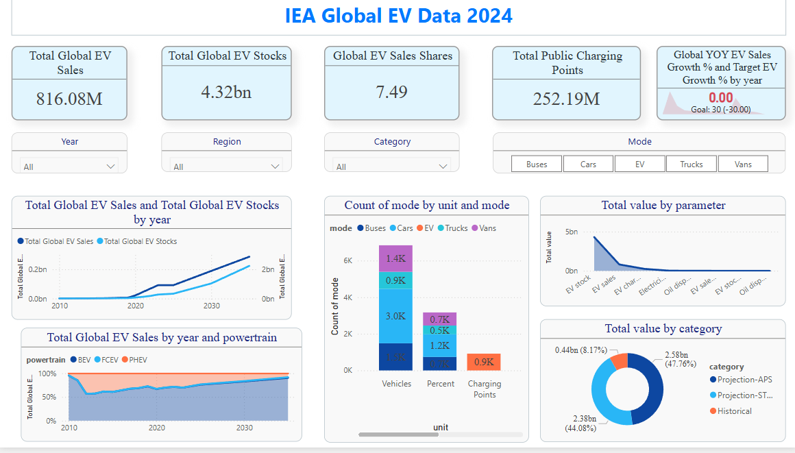

# Data-Analysis-Project-1
Electric Vehicle Insights using SQL + Power BI# 

## Global Electric Vehicle (EV) Data Analysis Project

This project analyzes global EV trends, forecasts, and adoption using SQL, Power BI, and IEA datasets. It includes dynamic dashboards, scenario comparisons (APS vs STEPS), and visual storytelling to support policy and business decisions.

---

##  Dashboard Preview

> *(View dashboard insights in the video below )*

---

##  Interactive Dashboard Walkthrough

Watch this short video to understand the key insights from the dashboard:

-- [Click to watch EV Dashboard Walkthrough](https://drive.google.com/uc?export=download&id=1iaMg-K9jAhyTFc89QtuxUQY07wDCUDkE)(#)  

---

## Project Files

| File                          | Description                                           |
|-------------------------------|-------------------------------------------------------|
| `ev_queries.sql`              | SQL queries used to clean and prepare raw EV data     |
| `IEA_EV_Theme_json__2024.json`| Custom Power BI theme for consistent visuals          |
| `screenshot.png`              | Dashboard preview image                               |
| `https://drive.google.com/file/d/1iaMg-K9jAhyTFc89QtuxUQY07wDCUDkE/view?usp=drive_link`| Screen recording of the dashboard|

---

## Data Insights Summary

This dashboard explores **global Electric Vehicle (EV) trends** using IEA data, covering total sales, stock, market share, and public infrastructure across regions and modes (cars, buses, trucks, vans). SQL and Power BI were used for data modeling, while custom Python logic was applied to calculate projections and year-over-year growth.

---

###  Dataset Coverage:
- Timeframe: 2010–2035 (actual + projection)
- Scope: **Global + regional data** (China, Europe, US, etc.)
- Metrics: **EV Sales, Stocks, Sales Share, Charging Points**
- Scenarios: **APS (Accelerated)** vs **STEPS (Stated Policies)**

---

###  Key Observations:
-  **EV Sales (2023)**: 14.2 million units sold globally  
-  **YOY Growth (2022→2023)**: +35.2%, indicating rapid adoption  
-  **Charging Points (2023)**: 2.7 million public chargers deployed  
-  **Future Forecast (APS)**:  
  - 2025: 18.5M  
  - 2030: 33M  
  - 2035: 45M  
-  **BEV vs PHEV (2030 APS)**: BEVs ~72%, PHEVs ~23%

---

###  What This Dashboard Helps With:
-  Track growth in EV adoption by region and vehicle type  
-  Compare EV targets across **policy scenarios (APS vs STEPS)**  
-  Understand infrastructure readiness (charging points)  
-  Supports decision-making for energy, auto, and policy sectors

>  Use slicers to filter by **mode, region, category, year**.  
> YOY growth, projections, and shares dynamically update for selected filters.

---

##  Tools & Tech Stack

- **SQL** – Data cleaning, transformation & aggregation
- **Power BI** – Interactive dashboards and visual storytelling
- **JSON Theme** – Custom styling to align with EV/green themes
- **Screen Recorder** – Dashboard walkthrough using Snipping Tool 

---

